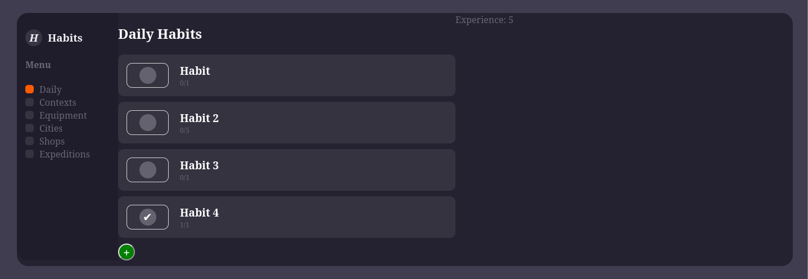

# Habit tracker

## General info
A gamified habit tracker written in microservice architecture in Java + Spring (backend) and Typescript + Angular (frontend).

 HABITS
 EQUIPMENT
 BATTLE

## Table of contents
* [General info](#general-info)
* [Technologies](#technologies)
* [Setup](#setup)
* [Features](#features)

## Technologies
Project is created with:
* Java
* Spring Boot 
* Spring Cloud
* Typescript
* Angular
* PostgreSQL
* RabbitMQ
* Redis

Additional libraries (backend):
* Lombok
* Jjwt library for JWT tokens
* RestAssured for testing

Additional libraries (frontend):
* ngx-markdown

## Setup
In order to run project you need to clone this repository and build project with Docker Compose:
```
$ git clone https://github.com/xpakx/habit-tracker.git
$ cd ladder
$ docker-compose up --build -d
```

To stop:
```
$ docker-compose stop
```

## Features
- [x] Posts
	- [x] Viewing new posts
